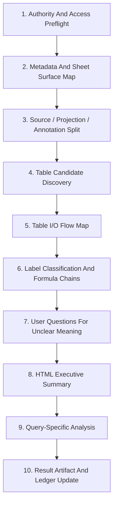

# Connected Sheets Understanding Process Summary

## Scope

This note summarizes the process used to understand the connected Google Sheet:

- Spreadsheet: `16vSTLkSxs-j3NxRJ8g_PNYGPuskQkJOWYBss_BDYQJg`
- Main projection sheet: `[ML] 매출_최종`
- Current metric basis: 결제액/payment amount
- Source label preserved from workbook: `매출`
- Accounting revenue basis: not applicable

This run was read-only. It used Sheets Bridge broker-backed bounded inspection
artifacts. Direct Sheets API, service-account-key reads, export/import, and
writeback were intentionally not used in this run; future write/edit paths must
be designed separately under the existing Excel/spreadsheet CRUD references.

## Top-Level Flow

## Initial Sheet Access Protocol

After authority and metadata preflight, the first understanding pass should use
this protocol before answering business questions.

| Step | Required Work | Output |
| --- | --- | --- |
| 1. Separate surfaces | Distinguish raw/source truth, result/final projection, and annotation/commentary text. Hidden or automation sheets are separate authority surfaces, not ordinary result tables. | Surface inventory with role claims and evidence ranges. |
| 2. Classify tables | Identify individual tables by shared formula structure, shared label structure, and spatial/range coherence. A table is not necessarily a whole sheet. | Table candidate list with spreadsheet ranges. |
| 3. Map table I/O | Infer input/output relationships among tables and draw a flow. Give each table a user-understandable name and show its range in spreadsheet syntax. | Mermaid dataflow plus table names/ranges. |
| 4. Classify labels | For each important label, decide whether it is raw input, intermediate/processed output, final output, annotation, or review-required. When processed, show the formula path from raw input to output and connect chains as far as evidence allows. | Label dictionary with role, meaning, formula path, source lineage, and status. |
| 5. Ask unresolved questions | Use label meaning and processing paths to identify what remains unclear, then ask the user targeted questions. | Review questions tied to specific labels/tables/ranges. |
| 6. Publish review HTML | Show the sheet understanding, executive summary, table map, I/O flow, label dictionary, formula chains, and unresolved questions in a reviewer-friendly HTML package. | Self-contained HTML review view. |

The protocol should produce claims with statuses such as accepted, sampled,
review-required, blocked, contradicted, or excluded. It should not collapse
uncertain semantic interpretation into final truth.

## Process Stages

| Stage | What We Did | Main Output | Gate / Caution |
| --- | --- | --- | --- |
| 1. Authority and access preflight | Checked whether CLI could obtain identity evidence without emitting tokens. When CAA blocked access, recorded blocker instead of bypassing. | `access-blocker.json` | No token output, no direct API workaround. |
| 2. Metadata and sheet surface map | Resolved spreadsheet title, tabs, row/column counts, target gid, hidden `SupermetricsQueries`, raw source tabs, and `SKU_legend`. | `metadata.json`, `chrome-record-package-check.json` | Metadata proves surface existence, not formula/result truth. |
| 3. Bounded capture | Read only bounded windows: headers, formula bands, value bands, and targeted query ranges. | `values-window-*`, `formula-window-*` | Large/wide sheets require cell-budgeted chunks. |
| 4. Formula dataflow profiling | Parsed formula inventory, reference edges, formula patterns, and region families from sampled windows. | `formula-inventory-*`, `formula-reference-edges-*`, `formula-pattern-groups-*`, `region-families-*` | Formula text is evidence, not final table truth. |
| 5. Region and pipeline gates | Grouped formulas into table-level pipeline candidates and applied sampled coverage, value-pair, source, automation, and self-reference gates. | `table-io-pipeline-candidates-*`, `region-family-gates-*`, `table-io-pipeline-gates-*` | Current result is sampled partial coverage. |
| 6. Automation inventory | Detected Supermetrics structural traces and separated missing Apps Script/Zapier proof from absence. | `connected-automation-inventory-*` | Hidden automation affects source freshness and authority. |
| 7. Metric basis correction | User confirmed `매출` means 결제액, not accounting revenue. We preserved source labels but changed semantic metric basis. | Metric basis section in summary/viewer | Labels are not semantic authority by themselves. |
| 8. Query-specific bounded analysis | For English/Japanese totals, `뜨든` presence, and recent decline candidates, built targeted reads and calculation gates. | `english-payment-roas-check-2026.json`, `japanese-payment-roas-check-2026.json`, `ddeudeun-current-sheet-check-20260605.json`, `recent-week-declining-courses-20260605.json` | Each business question needs its own evidence range and classification rule. |
| 9. Semantic/local-domain correction | Treated code families and sheet hierarchy as evidence, then accepted user-confirmed local aliases such as `류스펜나 -> 일본어 과정`. | Updated `japanese-payment-roas-check-2026.json` | Local aliases can override code heuristics but must still respect double-count gates. |
| 10. Ledger and review | Recorded every meaningful hypothesis, action, artifact, observation, and process decision. | `review-packages/workbook-understanding/process-ledger.jsonl` | Ledger entries are process evidence, not parser truth by themselves. |

## Query Pattern Used

For each business question, the working pattern became:

1. Define the target concept in business terms.
2. Find relevant sheet surfaces:
   - final projection: `[ML] 매출_최종`
   - transaction source: `[DB] raw_매출(26년)`
   - mapping source: `SKU_legend`
   - automation surface: `SupermetricsQueries`
3. Read only the smallest bounded ranges needed.
4. Classify candidate columns or rows.
5. Apply deterministic gates:
   - surface role gate
   - table boundary gate
   - table I/O lineage gate
   - label role gate
   - metric basis gate
   - date/window freshness gate
   - hierarchy/double-count gate
   - formula/dataflow support gate
   - semantic/local-domain gate
   - missing authority gate
6. Produce a small result artifact.
7. Add a process ledger entry.

## Examples From This Run

| Question | Process Decision | Result Shape |
| --- | --- | --- |
| 2026 English 결제액 | Use `BZ` English group total plus explicit English-labeled outside columns; reject blind `EN*` because it has false positives. | Working total and ROAS blocker. |
| 2026 Japanese 결제액 | Use `K` Japanese group total plus JP/PMJP or explicit Japanese-language outside columns; later add local alias `류스펜나`. | Working total plus semantic completeness warning. |
| `뜨든` captured? | Check final projection headers, raw 2026 order/SKU split values, and `SKU_legend`. | No checked evidence found; near matches are unrelated. |
| Recent declining courses | Exclude current-day all-zero row, use latest completed 7 days, separate course-code candidates from total columns. | Watchlist candidates, not confirmed demand decay. |

## Reusable Principles

- On first access, split source truth, final projection, and annotation text before interpreting any table.
- A table is a coherent range with shared formulas, labels, role, and boundaries. It is not automatically the whole sheet.
- Every table in the review output should have a user-friendly name and a spreadsheet range.
- Table I/O maps should be shown visually with generated SVG in the HTML review package, not Mermaid-only source text.
- Business-question answers should default to HTML review pages with SVG flows and sortable tables.
- Label definitions must distinguish raw input, intermediate output, final output, annotation, and review-required concepts.
- Processed labels need formula/path evidence back to raw inputs whenever available.
- Domain knowledge should be injected through explicitly selected general/local domain packs, not hardcoded into analysis scripts.
- Treat the final sheet as a projection, not necessarily as the source of truth.
- Treat raw rows, formulas, headers, hidden tabs, and mapping tables as separate evidence surfaces.
- Preserve workbook labels but store corrected semantic metric basis separately.
- Do not merge categories from code prefixes alone. Use sheet hierarchy, labels, formulas, and local-domain aliases together.
- Exclude totals when child columns are included, unless the total is the only accepted representation of that group.
- Current-day rows and future prebuilt rows need freshness gates before trend analysis.
- ROAS cannot be computed unless matching ad-spend evidence is present and scoped to the same period/category.
- Store compact result artifacts and ledger entries rather than raw data dumps.
- The tested approach is currently strongest for data-processing-centered spreadsheets, but it is an added capability rather than a fixed boundary. Extend it to Excel workbooks and document-shaped cases when the required visual/layout evidence and existing Excel/spreadsheet CRUD principles are satisfied.

## Current Reusable Artifacts

| Artifact | Purpose |
| --- | --- |
| `review-packages/sheets-bridge/formula-dataflow/20260603-16vstlk-gid-1116370414/index.html` | Human review viewer for sampled formula/dataflow evidence. |
| `formula-dataflow-review-summary-ML-sales-final-sampled.json` | Compact sampled formula/dataflow summary. |
| `region-dataflow-graph-ML-sales-final-sampled.json` | Region-level candidate graph. |
| `connected-automation-inventory-ML-sales-final-sampled.json` | Automation trace inventory. |
| `english-payment-roas-check-2026.json` | English payment amount query artifact. |
| `japanese-payment-roas-check-2026.json` | Japanese payment amount query artifact with local-domain override. |
| `ddeudeun-current-sheet-check-20260605.json` | Keyword presence check artifact. |
| `recent-week-declining-courses-20260605.json` | Recent completed-week decline watchlist artifact. |

## Next Process Improvements

1. Package the data-processing spreadsheet analysis capability without replacing the existing Excel/spreadsheet CRUD guidance.
2. Define domain pack contracts for metrics, aliases, classification rules, and question presets.
3. Implement the initial sheet access protocol as a reusable pipeline.
4. Build table-boundary discovery from shared formula structures and shared label structures.
5. Generate SVG table I/O maps automatically with user-friendly names and spreadsheet ranges.
6. Build a label dictionary that records raw/processed/final/annotation roles and formula chains.
7. Add reusable HTML answer rendering with sortable tables.
8. Build a course semantic classifier over all header columns.
9. Add a local-domain alias table with source, confidence, and review status.
10. Add raw-order cross-checks for high-impact query results.
11. Add ad-spend source binding before ROAS calculations.
12. Expand formula/value coverage beyond sampled windows before promoting full-sheet dataflow claims.
13. Turn repeated query patterns into reusable scripts with explicit input/output schemas.
14. Add npm/global install and Chrome extension/native-host integration as the target local operation model for connected Sheets, while keeping local Excel workbook analysis as a first-class input path.

## Package Direction

The connected-Sheets testing path now informs an installable, extensible
spreadsheet analysis package direction documented in
`docs/data-processing-spreadsheet-package-design.md` and ADR
`docs/adr/0002-data-processing-spreadsheet-package.md`.

This direction starts from formula/dataflow-heavy spreadsheets and should
produce local HTML answer packages with SVG visualization, sortable tables,
explicit domain-pack selection, deterministic gates, and process ledger entries.
It must remain compatible with local Excel workbook analysis and the existing
spreadsheet CRUD references.
