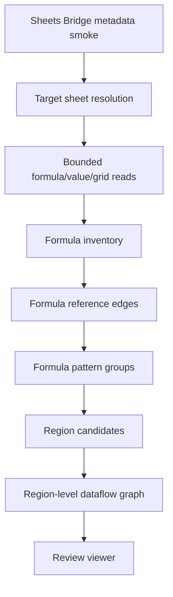

# Sheets Formula Dataflow Discovery Design

Last updated: 2026-06-04

## Purpose

This design covers the first small problem before general unstructured spreadsheet understanding:

```text
Discover data-to-data connections inside a Google Sheet from formulas.
Do not refactor, rewrite, or automate changes in this stage.
```

The output is a read-only map of formula-based connections between regions that may later become tables, calculation surfaces, or report outputs.

## Metric Basis

The workbook labels use `매출`, but the user-confirmed business meaning for
this target sheet is **결제액/payment amount**, not accounting revenue. Treat
`[ML] 매출_최종`, `[DB] raw_매출(26년)`, and related `매출`-named tabs as
payment-amount operational reporting surfaces unless later evidence proves a
separate accounting revenue basis.

## Current Target Sample

- Spreadsheet: `16vSTLkSxs-j3NxRJ8g_PNYGPuskQkJOWYBss_BDYQJg`
- Target gid: `1116370414`
- Access path: Sheets Bridge CLI -> Cloud Run broker -> Sheets API
- Current status: sampled formula dataflow, connected automation inventory, and deterministic gate rollups are generated. CLI access worked on 2026-06-04 for metadata and bounded target-sheet formula/value windows; the next live read should inspect the hidden Supermetrics configuration tab when access is available.
- Blocker artifact: `review-packages/sheets-bridge/formula-dataflow/20260603-16vstlk-gid-1116370414/access-blocker.json`
- Chrome record package check: `review-packages/sheets-bridge/formula-dataflow/20260603-16vstlk-gid-1116370414/chrome-record-package-check.json`
- First CLI formula/value window summary: `review-packages/sheets-bridge/formula-dataflow/20260603-16vstlk-gid-1116370414/first-window-summary-ML-sales-final-A1-AN453.json`
- Sampled formula dataflow artifacts: `formula-inventory-ML-sales-final-sampled.json`, `formula-reference-edges-ML-sales-final-sampled.json`, `formula-pattern-groups-ML-sales-final-sampled.json`, `region-families-ML-sales-final-sampled.json`, `table-io-pipeline-candidates-ML-sales-final-sampled.json`, `connected-automation-inventory-ML-sales-final-sampled.json`, `region-family-gates-ML-sales-final-sampled.json`, `table-io-pipeline-gates-ML-sales-final-sampled.json`, `region-dataflow-graph-ML-sales-final-sampled.json`, `formula-dataflow-review-summary-ML-sales-final-sampled.json`, and `index.html`

No direct Sheets API or service-account-key workaround should be used for this stage.

## Access Alternatives

The default path remains Sheets Bridge because it preserves connected-document identity,
broker policy limits, sanitized artifacts, and user-principal authority. Other paths are
allowed only when their authority downgrade is explicit.

| Path | Use when | Authority / risk |
|---|---|---|
| Same Sheets Bridge from a CAA-compliant environment | Local `gcloud` is blocked, but the user's managed device or approved remote desktop can issue identity tokens. | Best alternative. Preserves broker policy and user-principal authority. |
| Chrome extension broker inspect + native-host record package | CLI `gcloud` token issuance is blocked, but the managed Chrome session can produce a broker-backed sanitized inspection snapshot and record it locally. | Good practical alternative. `record package` alone does not solve auth; the upstream broker inspect must succeed first. |
| Broker-launched job from an approved web/control surface | CLI token issuance is repeatedly blocked and a small control plane can verify the user separately. | Good future design. Requires broker/auth contract changes before use. |
| User-executed bounded Apps Script / formula dump | We need a quick prototype of formula inventory and the user can run a read-only script in their own browser session. | Useful diagnostic evidence, but manual and less repeatable. Treat as user-provided evidence, not broker authority. |
| User-provided `.xlsx` export or local copy | We only need a low-fidelity parser prototype. | Can lose live Sheet identity, Google-specific functions, protections, pivot/filter metadata, import state, and formula-result authority. Not authoritative for connected Sheets. |
| Direct service-account/API read | A separate service-account authority is explicitly accepted. | Not recommended for this stage. It changes authority from user ACL to service account and can misrepresent `IMPORTRANGE`/permission behavior. |
| Browser/DOM scraping | Only visual UI evidence is needed. | Fragile and incomplete for formulas, hidden state, pivots, and deterministic gates. Not suitable as dataflow authority. |

## Scope

In scope:

- Read-only metadata smoke.
- Bounded formula/value/grid windows through Sheets Bridge.
- Formula inventory.
- Formula reference parsing.
- Formula pattern grouping.
- Region/cluster candidates from formulas.
- Region-level dataflow graph.
- Connected automation inventory from sheet-internal metadata signals.
- Deterministic region-family and pipeline gate rollups.
- HTML/Mermaid review viewer.

Out of scope:

- Formula rewrites.
- Refactoring plans.
- Automated edits.
- Writeback.
- Semantic ontology generation.
- Shared ontology promotion.

## Top-Level Flow



## Claim-Ledger Framing

Use the evidence-backed claim model even for this narrow problem.

| Item | Treatment |
|---|---|
| Formula text observed in a cell | Evidence |
| Formula reference parsed from text | Derived evidence / deterministic claim |
| A contiguous formula pattern region | Structural candidate claim |
| A referenced range is an input region | Role candidate claim |
| A formula region is a calculation/output region | Role candidate claim |
| A table-level edge exists between regions | Dataflow candidate claim |
| External/dynamic reference cannot be resolved | Blocked or review-required claim |

This stage should not claim final document semantics.

## Artifacts

Target directory pattern:

```text
review-packages/sheets-bridge/formula-dataflow/{run-id}/
```

Initial artifacts:

- `metadata.json`: broker metadata response.
- `target-sheet.json`: resolved sheet title, gid, dimensions, hidden state, and profile bounds.
- `formula-window.json`: broker formula-window response.
- `values-window.json`: broker values-window response over the same bounds.
- `grid-window.json`: optional broker grid-window response when policy allows.
- `formula-inventory.json`: formula cells and formula text.
- `formula-reference-edges.json`: parsed cell/range dependencies.
- `formula-pattern-groups.json`: normalized relative formula signatures and grouped output regions.
- `region-candidates.json`: formula-source and formula-output region candidates.
- `region-dataflow-graph.json`: region-level graph with edge reasons.
- `index.html`: review viewer with tables and Mermaid graph.
- `access-blocker.json`: present when access is blocked before analysis.

## Read Strategy

1. Run `inspect.metadata`.
2. Resolve `gid` to sheet title and dimensions.
3. Start with a bounded profile window around the target area.
4. Prefer `inspect.formula_window` and `inspect.values_window` over full-sheet reads.
5. Use `inspect.grid_window` only when hidden/view-state/style/pivot/object context is needed and allowed.
6. Expand windows only when formula references point outside the current bounds.

## Formula Reference Model

Each formula observation should record:

- sheet title and sheet id
- cell address
- formula text
- formula classification
- parsed references
- referenced sheet
- referenced range
- reference kind: same-sheet, cross-sheet, external, dynamic, unresolved
- authority: formula text only
- result authority: not established unless probed separately

## Formula Pattern Grouping

Normalize formulas by relative references.

Example:

```text
E10 = D10*C10
E11 = D11*C11
E12 = D12*C12
```

Pattern signature:

```text
R[0]C[-1] * R[0]C[-2]
```

Pattern groups should record:

- output region
- signature
- formula count
- contiguous runs
- referenced relative ranges
- drift cells
- dynamic/external flags
- review status

## Region-Level Dataflow Graph

Cell-level references are too granular for review. Project them into region edges.

Node kinds:

- `formula_output_region`
- `referenced_input_region`
- `mixed_formula_value_region`
- `external_source_region`
- `dynamic_reference_region`
- `unresolved_reference_region`

Edge kinds:

- `direct_reference`
- `lookup`
- `aggregate`
- `filter`
- `projection`
- `calculation`
- `external_reference`
- `dynamic_reference`
- `unresolved_reference`

Edge statuses:

- `observed`
- `candidate`
- `review_required`
- `blocked`

## Initial Gates

Even without refactoring, discovery needs gates:

- Formula parse gate.
- Reference resolution gate.
- Range existence gate.
- Dynamic reference gate.
- External reference gate.
- Formula pattern stability gate.
- Formula drift gate.
- View-state relevance gate.
- Pivot/array/spill detection gate.
- Coverage gate for references outside sampled windows.
- Formula-result value-pair gate.
- Whole-column same-sheet self-reference gate.
- Connected automation context gate.

## Viewer Requirements

The HTML viewer should show:

- target sheet identity and bounds
- formula inventory summary
- formula pattern groups
- unresolved/dynamic/external references
- region candidates
- Mermaid region dataflow graph
- review-required blockers
- next window reads to resolve uncovered references

## Immediate Blocker Resolution

Current blocker:

```text
gcloud auth print-identity-token
-> was blocked by Context Aware Access on 2026-06-03
-> succeeded on 2026-06-04
```

Identity-token issuance for `kangmin.lee@day1company.co.kr` now works in the current environment. Continue with bounded broker windows; do not output or store tokens.

Alternative verified on 2026-06-03:

```text
Chrome extension broker inspect.metadata
-> native-host record package
-> metadata package recorded for spreadsheet 16vST...
```

This confirms broker-backed metadata authority through the managed Chrome path.
It does not yet provide formula dataflow evidence because the recorded package
contains no formula/value windows.

CLI verified on 2026-06-04:

```text
gcloud identity-token preflight
-> inspect.metadata
-> inspect.formula_window '[ML] 매출_최종'!A1:AN453
-> inspect.values_window '[ML] 매출_최종'!A1:AN453
```

The first window contains 13,026 formula cells and 17,057 non-empty cells.
It covers columns A:AN only; the target sheet has 1,848 columns, so full dataflow
discovery still requires chunk planning.

Sampled dataflow generated on 2026-06-04:

```text
7 sampled windows
38,029 formula cells
174,562 reference edges
26,412 formula pattern groups
152 region families
8 table-level pipeline candidates
```

Main observed payment-amount source candidates are `[DB] raw_매출(26년)`,
`[ML] 매출_최종` self-aggregation, and `[DB] raw_매출(26년)누적`.
This remains sampled partial coverage; full-sheet conclusions require more
full-height column chunks or a stronger sparsity/region heuristic.

Connected automation inventory generated on 2026-06-04:

```text
Supermetrics: detected
Evidence: hidden tab `SupermetricsQueries`, named ranges `zsupermetrics_refreshAllSilent`,
`zsupermetrics_refreshAll`, and `zsupermetrics_forceRefresh`
Zapier: not detected in current artifacts, not absence-proof
Apps Script: not inspected with current broker authority
```

This means source freshness, refresh scope, and connector target ranges remain
review-required before source-sheet pipelines can be promoted beyond sampled
formula evidence. The next live inspection should read bounded grid/value
windows from `SupermetricsQueries`, not the whole hidden tab by default.

Top sampled payment-amount pipeline candidates:

| Source | Formula role | Families | Formula cells | Status |
|---|---:|---:|---:|---|
| `[DB] raw_매출(26년)` | cross-sheet conditional aggregate (`SUMIFS`) | 47 | 27,147 | review-required |
| `[ML] 매출_최종` | same-sheet vertical sum | 48 | 5,018 | review-required |
| `[ML] 매출_최종` | same-sheet horizontal sum | 47 | 4,516 | review-required |
| `[ML] 매출_최종` | arithmetic/no-function formulas | 1 | 596 | sampled-accepted |
| `[ML] 매출_최종` | same-sheet conditional aggregate | 1 | 416 | review-required risk |
| `[DB] raw_매출(26년)누적` | cross-sheet conditional aggregate (`SUMIFS`) | 2 | 186 | review-required |

The same-sheet conditional aggregate candidate includes whole-column references
such as `C:C` from formula cells in the same column. Treat this as a review item
until circularity/result-state and source-region intent are checked.

## Next Implementation Step

Current gate result:

```text
Region families: 6 sampled-accepted, 146 review-required
Pipeline candidates: 2 sampled-accepted, 6 review-required
Coverage gates: 10 sampled-accepted, 142 review-required
Formula-result value-pair gates: 10 sampled-accepted, 142 review-required
Connected automation context gates: 49 review-required
Whole-column same-sheet self-reference gates: 1 review-required
```

Next:

1. Inspect bounded windows from the hidden `SupermetricsQueries` tab when broker access is available.
2. Classify Supermetrics query targets, refresh scope, and source-sheet impact.
3. Use the coverage/value-pair gates to choose the next full-height column chunks.
4. Promote only gate-supported table-level input/output pipeline claims; keep all broader conclusions review-required until coverage and automation context are resolved.
