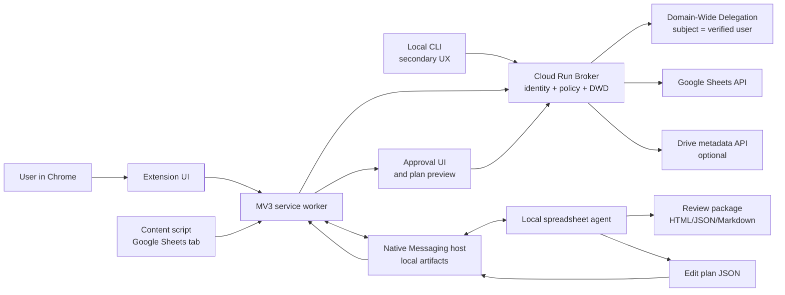

# Chrome Extension Sheets Bridge Design

## 1. Purpose

This document defines a Chrome Extension, optional Local CLI, Cloud Run broker,
and Native Messaging based bridge for inspecting and editing existing Google
Sheets without giving the LLM, local agent, extension, or CLI direct Google API
credentials. The broker verifies the end-user identity on every call, uses
Cloud Run keyless service identity plus Workspace Domain-Wide Delegation to
impersonate that same user, checks bridge policy, calls Sheets API, and returns
sanitized snapshots/results. Existing Sheets remain live and in place.

For implementation, use
[codex-goal-chrome-extension-sheets-bridge.md](codex-goal-chrome-extension-sheets-bridge.md)
as the controlling execution spec. This design explains the architecture; the
goal spec fixes paths, contracts, and phase completion criteria.

The current core decision is:

- Cloud Run broker owns user identity verification, DWD impersonation, bridge
  policy enforcement, Sheets API reads/writes, retry/budget handling, and broker
  audit logs.
- Chrome Extension owns active Sheet detection, user intent, identity hints,
  approval UI, broker calls, and compact native-host communication for local
  artifacts.
- Local CLI is a secondary client for smoke tests, batch inspection, artifact
  regeneration, and operational workflows; it uses the same broker API and
  policy as the extension.
- Native Messaging host owns local artifacts and local agent invocation. It does
  not own Google credentials or Sheets API calls.
- OAuth tokens, ID tokens, service account credentials, access tokens, and raw
  credentials never enter the local agent, native messages, review packages, or
  repository.
- User-specific permissions are enforced by broker policy and Google ACLs under
  DWD impersonation of the verified user.
- Phase execution, message contracts, Apply Plan Gate, rollback artifacts, and
  phase locks are controlled by
  [codex-goal-chrome-extension-sheets-bridge.md](codex-goal-chrome-extension-sheets-bridge.md).

## 2. Goals

- Use the user's Chrome tab as the primary low-friction entry point, with a CLI
  for power/ops workflows, while keeping Google API access inside the broker.
- Avoid `.xlsx` export/edit/upload workflows for existing connected Sheets.
- Read actual Sheets metadata, formulas, validations, protections, and live
  error/loading states through the Sheets API.
- Generate review packages and edit plans locally.
- Apply approved plans through bounded, range-scoped Sheets API operations.
- Preserve `spreadsheetId`, `sheetId`, formulas, protected ranges, validations,
  named ranges, and external dependencies unless explicitly changed.
- Support timeout, quota, `IMPORTRANGE`, Apps Script, and rollback-aware
  workflows.

## 3. Non-Goals

- Do not scrape Google Sheets grid DOM as the primary data source.
- Do not reuse browser cookies outside Chrome.
- Do not pass raw OAuth tokens, service account keys, signed JWTs, access
  tokens, or private keys to local agents, shell processes, native messages,
  content scripts, review packages, or local artifacts. The extension service
  worker may hold only broker authentication evidence transiently.
- Do not replace existing Sheets with uploaded `.xlsx` files.
- Do not support arbitrary Drive-wide automation in the first version.
- Do not use `googleworkspace/cli` as the broker, Local CLI runtime, subprocess
  backend, or credential path. It is allowed only as a reference tool for API
  shape exploration, JSON output conventions, and CLI UX ideas.

## 4. Architecture



## 5. Components

### Chrome Extension

Manifest V3 extension with:

- `background` service worker for active Sheet context, user intent, user
  identity token/session acquisition, broker calls, Native Messaging, plan
  preview, approval UI state, and status display.
- `content_script` on `https://docs.google.com/spreadsheets/*` for detecting the
  active spreadsheet id and current tab context.
- `popup` or `side_panel` UI for `Inspect`, `Generate Plan`, `Review`, and
  `Apply Plan` preview/approval/status display.
- `chrome.identity` or equivalent browser identity flow is used to authenticate
  the user to the broker. It is not used for direct Sheets API calls from the
  extension.
- `chrome.runtime.connectNative` or `sendNativeMessage` for local host
  communication.

The extension must not call Google Sheets APIs directly.

### Local CLI

Secondary client for repeatable and operational workflows:

- obtains broker-accepted user identity/session evidence without requesting
  Sheets API scopes
- sends the same inspect/plan/apply request contracts as the extension
- supports batch inspect, smoke tests, review package regeneration, and CI-like
  validation
- never calls Sheets API directly and never receives broker credentials

`googleworkspace/cli` can inform Local CLI command shape, JSON output, and API
examples, but the product CLI must call only the Cloud Run broker.

### Native Messaging Host

Small local process installed on the user's machine:

- receives sanitized broker snapshots/results, user intent, and compact local
  artifact requests
- calls the local spreadsheet agent
- writes review packages, dry-run plans, approval evidence, before-state
  manifests, apply results, and rollback instructions to local disk
- returns plan manifests and compact summaries to the extension

The host must be registered with Chrome and allow only the expected extension id.
For large payloads, pass file paths or chunk manifests rather than oversized
single messages. Chrome Native Messaging has strict message-size limits, so the
default protocol should keep host responses small and store large artifacts on
disk.

### Cloud Run Broker

SRE/Infra-managed HTTPS service:

- verifies user identity token/session on every call
- enforces default-deny bridge policy
- impersonates the verified user through Workspace Domain-Wide Delegation
- calls Sheets API and optional Drive metadata API
- returns sanitized snapshots, plan-read data, and apply results
- writes broker audit logs with request id, verified principal, impersonated
  subject, policy decision id, spreadsheet id, operation, and result summary
- never returns OAuth tokens, ID tokens, access tokens, DWD credentials, service
  account credentials, or raw API credentials to clients

### Local Spreadsheet Agent

Local agent code that:

- summarizes sheet structure
- classifies formulas and connected risks
- generates review packages
- drafts edit plans
- suggests rollback instructions and inverse plans when feasible

The agent never needs Google credentials because the Cloud Run broker supplies
sanitized reads and writes. It must not decide whether a live write is approved;
the extension owns the visible approval UI, the broker owns final policy and
Apply Plan Gate enforcement, and the host only persists local artifacts.

## 6. Permission Model

### Broker Identity, DWD, And User Policy

Google access and human authorization are separate:

- User identity comes from the Chrome Extension or Local CLI and is verified by
  the broker on every call.
- Google access comes from the broker using Cloud Run runtime service identity
  plus Workspace Domain-Wide Delegation with `subject` equal to the verified
  user principal.
- Human authorization comes from a default-deny broker policy mapping user
  principals to allowed operations, risk levels, sheet ids, ranges, and optional
  spreadsheet ids. For read-only metadata inspect, a spreadsheet wildcard may
  delegate actual spreadsheet reachability to the impersonated user's Google
  ACL.

### Phase 1: Read-Only Inspect Foundation

Chrome extension permissions:

- `activeTab`
- `nativeMessaging` when local artifacts are needed
- content script access to Google Sheets URLs
- identity permission or browser login flow sufficient to authenticate to the
  broker

Broker DWD scopes:

- `https://www.googleapis.com/auth/spreadsheets.readonly` for read-only
  inspection
- optional Drive metadata scope only when a phase explicitly needs it

### Write Mode: Apply Plan (Phase 5+)

Additional broker DWD scope:

- `https://www.googleapis.com/auth/spreadsheets`

Drive scope should stay optional. If rollback or title/owner metadata requires
Drive, use the narrowest viable metadata/read scope and make the extra permission
visible to the user.

### Admin Controls

For organization use:

- publish the extension privately or internally
- deploy Cloud Run broker with a locked-down runtime service account
- authorize Workspace Domain-Wide Delegation with narrow scopes
- distribute broker policy through SRE/Infra-managed deployment controls
- allow or force-install the extension through Chrome Enterprise policy
- install the Native Messaging host through MDM or an internal installer

## 7. Data Flows

### Inspect Flow

1. User opens a Google Sheet and clicks `Inspect`.
2. Content script extracts `spreadsheetId` from the active tab URL.
3. Extension sends user identity token/session, active spreadsheet id, tab
   context, and inspect intent to the Cloud Run broker.
4. Broker verifies the user, checks policy, impersonates that user through DWD,
   and reads spreadsheet metadata without full grid data.
5. Broker reads targeted formula, validation, protection, named range, and
   error/loading data in bounded chunks.
6. Broker returns a sanitized inspection snapshot and policy/audit summary.
7. Extension sends the sanitized snapshot to the Native Messaging host.
8. Native host writes a review package from local agent output and returns a
   compact summary.
9. Extension shows structure, risks, policy status, and next actions.

### Plan Flow

1. User describes the intended change in the extension UI.
2. Agent produces an edit plan JSON with explicit operations, preconditions,
   risk flags, timeout budget, rollback snapshot requirements, and readback
   ranges.
3. Extension validates the plan schema and displays a preview.
4. User approves or rejects the plan.

### Apply Plan Flow

1. Extension/CLI sends exact plan, approval evidence, and user identity evidence
   to the broker.
2. Broker verifies the user, policy, risk, approval evidence, and DWD subject.
3. Broker re-reads plan precondition ranges from the live spreadsheet.
4. Broker confirms `spreadsheetId`, `sheetId`, range, formula, validation, and
   protection preconditions.
5. Broker captures before-state for changed ranges.
6. Broker executes bounded Sheets API batches.
7. Broker polls dependent output and external loading ranges within the wait
   budget.
8. Broker re-reads changed cells and dependent outputs.
9. Broker returns sanitized apply result to the extension/CLI.
10. Native host persists the apply result package and returns `apply.result`
   with final status and artifact path.
11. User receives applied range summary, readback status, rollback status, and
   unresolved risks.

## 8. Edit Plan Contract

An edit plan is a declarative JSON artifact. It must be safe to review before
execution and deterministic enough for the extension to validate.

Required top-level fields:

```json
{
  "schema_version": "1.0",
  "plan_id": "uuid",
  "spreadsheet_id": "...",
  "created_at": "2026-05-27T00:00:00Z",
  "intent": "Short human-readable purpose",
  "mode": "dry_run|apply",
  "risk_level": "low|medium|high",
  "timeout_budget": {
    "read_seconds": 60,
    "write_seconds": 60,
    "poll_seconds": 120
  },
  "preconditions": [],
  "operations": [],
  "readback": [],
  "rollback": {}
}
```

Operation families:

- `update_values`
- `update_formulas`
- `repeat_cell_format`
- `set_data_validation`
- `insert_dimension`
- `delete_dimension`

High-risk operations such as deleting dimensions, replacing formulas with
values, or changing import formulas require an explicit
`requires_explicit_approval: true` flag.

## 9. Safety Rules

- OAuth tokens, ID tokens, service account credentials, DWD credentials, and
  access tokens never enter native messages, local agent prompts, review
  packages, or repository files.
- Broker validates every plan and policy decision before writing.
- Plan operations must target the active `spreadsheetId`.
- Use `sheetId` rather than sheet title for structural operations.
- Re-read preconditions immediately before applying.
- Bind approval evidence to the exact `plan_id`, `spreadsheetId`, operation ids
  or affected ranges, risk level, timestamp, and visible confirmation text.
- Do not overwrite formula cells with values unless explicitly requested.
- Do not modify protected ranges unless the plan calls that out and the API
  permits it.
- Apply operations in small coherent batches, not mega-batches.
- Stop on repeated `429`, `503`, timeout, or precondition mismatch.
- Record before-state and apply result for every changed range.
- Persist apply results with `apply.record`; treat `apply.result` as the host
  response, not a request.

## 10. Timeout And Large Payload Strategy

- Keep API payloads under practical size limits and chunk large reads/writes.
- Avoid `includeGridData` except for targeted ranges.
- Use field masks.
- Use truncated exponential backoff for `429`, `503`, and transient network
  failures.
- Treat `Loading...`, `#REF!`, `#ERROR!`, and `#N/A` as states to classify, not
  successful readback.
- Native Messaging messages should stay compact; large review artifacts live on
  disk and are referenced by manifest paths.
- Avoid using Native Messaging as a bulk data pipe. The extension should chunk
  reads and send only the data needed for analysis or local artifact creation.

## 11. Rollback Model

Google Sheets version history is useful, but the extension should not rely on it
as the only rollback mechanism.

Before apply:

- capture before-state for changed cells, formulas, formats, validations, and
  relevant metadata in a before-state artifact or chunk manifest
- record spreadsheet URL, title, target sheet ids, and changed ranges
- if available through the user's environment, create or instruct a named version
  checkpoint

After apply:

- produce an inverse plan artifact when feasible
- record rollback instructions and limitations in the apply result
- record whether rollback depends on Google Sheets manual version history
- warn that restoring an old version can revert collaborator changes made after
  the checkpoint

## 12. Deployment Options

### Internal MVP

- unpacked extension for pilot users
- local Native Messaging host installer
- Cloud Run broker pilot endpoint
- read-only broker DWD scope
- broker default-deny user policy
- Local CLI smoke path
- manual review package output

### Managed Internal Release

- private Chrome Web Store or enterprise extension distribution
- fixed extension id
- Cloud Run broker with keyless runtime service identity
- Workspace Admin Domain-Wide Delegation
- managed broker policy distribution
- Local CLI package for ops and batch workflows
- Chrome Enterprise allowlist or force install
- signed Native Messaging host installer

### Future Product Form

- extension side panel
- local or hosted agent service
- policy-driven operation allowlist
- central audit log
- team-level templates for common spreadsheet edits

## 13. Open Decisions

- Whether review packages may later be mirrored to Drive after the local-first
  artifact contract is stable.
- Whether a future remote planning service is acceptable after the local MVP.
- Whether Drive metadata scope is acceptable for title/revision context in a
  managed deployment.
- Whether Local CLI should support only inspect/review flows initially or also
  apply flows after Phase 5.
- How organization policy should handle team-level operation allowlists and
  second-review requirements.

## 14. Apply Plan Release Gate

Do not enable write operations in pilot builds until all of the following exist:

- read-only inspect has passed pilot testing
- edit plan schema validation
- operation allowlist
- canonical Apply Plan Gate from the goal spec
- explicit user approval evidence bound to the exact plan and affected ranges
- precondition re-read
- before-state capture
- bounded retry and polling
- live readback
- `apply.record` persistence and `apply.result` response
- apply result artifact with rollback instructions, inverse-plan status, and
  limitations
- no OAuth token, ID token, access token, service account credential, DWD
  credential, private key, signed JWT, `Bearer` header, or raw credential
  exposure to the local agent, native messages, review packages, repository, or
  logs

## Official References

- Chrome Identity API: https://developer.chrome.com/docs/extensions/reference/api/identity
- Chrome Native Messaging: https://developer.chrome.com/docs/extensions/develop/concepts/native-messaging
- Chrome Extension force install policy: https://chromeenterprise.google/policies/extension-install-forcelist/
- Workspace app access controls: https://support.google.com/a/answer/7281227
- Workspace domain-wide delegation: https://support.google.com/a/answer/162106
- Cloud Run service identity: https://cloud.google.com/run/docs/securing/service-identity
- Google Workload Identity Federation: https://cloud.google.com/iam/docs/workload-identity-federation
- Sheets API usage limits: https://developers.google.com/workspace/sheets/api/limits
