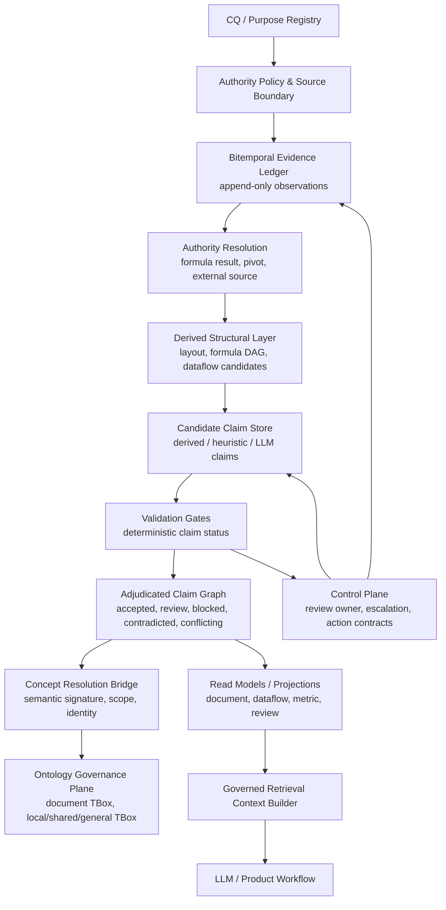

# Evidence-Backed Spreadsheet Claim Ledger Design

Last updated: 2026-06-03

## Purpose

This document records the revised top-level architecture for extracting, storing, and connecting meaning from document-shaped spreadsheets.

The goal is not to parse tables from rows and columns. The goal is to accumulate evidence-backed, reviewable claims about a spreadsheet, then project those claims into document structure, dataflow, semantic ontology, review queues, and LLM retrieval contexts.

## Design Thesis

Unstructured spreadsheet understanding should be centered on an evidence and claim ledger, not on a single validated ontology graph.

```text
Observations and claims are recorded with time, version, authority, provenance, and status.
Document graphs, dataflow graphs, ontology graphs, review queues, and LLM context packs are projections over that record.
```

This avoids turning uncertain layout, semantic, or ontology interpretations into premature truth.

## Core Principles

- LLMs propose claims; they do not create accepted truth.
- Deterministic gates classify claim status; they do not create truth.
- Claims can be `accepted`, `review_required`, `blocked`, `contradicted`, or `conflicting`.
- Blocked, contradicted, and conflicting claims must be preserved, not discarded.
- Deterministically derived facts and LLM semantic proposals must be separated.
- Ontology is both an input constraint plane and an output projection.
- Retrieval must use governed context packs, not raw graph dumps.
- Actionability requires instance binding, relation binding, accountable review ownership, runtime proof, and writeback policy.
- Identity, anchoring, provenance, lineage, version, time, and authority are cross-cutting axes across all layers.

## Revised Top-Level Architecture



## Layer Responsibilities

| Layer | Responsibility | Must not do |
|---|---|---|
| CQ / Purpose Registry | Defines why the document is being parsed, what questions must become answerable, and when extraction is sufficient. | It must not be decorative metadata. It scopes extraction, gates, and review priority. |
| Authority Policy & Source Boundary | Defines workbook/sheet/source authority, permissions, visible state, snapshot identity, read/write limits, and sensitive boundaries. | It must not silently treat all observed data as equally authoritative. |
| Bitemporal Evidence Ledger | Append-only record of observations, captures, parser outputs, broker reads, reviewer decisions, gate decisions, and source changes. | It must not overwrite prior observations or hide stale evidence. |
| Authority Resolution | Labels value/result authority, including formula text vs formula result, pivot source/cache/settings, external source freshness, and engine-relative outputs. | It must not promote formula text, render-only values, or stale external cache as result authority. |
| Derived Structural Layer | Deterministically derived or heuristic structural hypotheses such as layout regions, formula DAG, pivot metadata, view-state effects, and dataflow candidates. | It must not treat layout segmentation or grouping as accepted semantic truth. |
| Candidate Claim Store | Stores structural, relation, semantic, equivalence, dataflow, ontology, action, and review claims with provenance. | It must not merge all claim kinds or hide the source of a claim. |
| Validation Gates | Deterministically classify claim status using required authority, source, layout, formula, pivot, semantic, ontology, and action gates. | They must not be described as truth creation. |
| Adjudicated Claim Graph | Stores classified claims and dependency/status propagation across claims. | It must not drop blocked or contradicted claims. |
| Concept Resolution Bridge | Normalizes semantic signatures, separates senses, merges synonyms only when evidence supports it, and maps local/shared/general concept scope. | It must not create bare-label ontology concepts. |
| Ontology Governance Plane | Maintains applied document-structure ontology, generated semantic ontology, local/shared/general scope, versioning, and promotion state. | It must not treat local concepts as shared concepts without promotion evidence. |
| Read Models / Projections | Generates document item, dataflow, metric, source lineage, ontology, review queue, and action views from adjudicated claims. | It must not become the canonical source of truth. |
| Governed Retrieval Context Builder | Builds LLM/UI context packs with status, authority, evidence citations, version pins, and token-aware scope. | It must not expose raw unfiltered candidate graphs as accepted truth. |
| Control Plane | Routes review ownership, evidence requests, action contracts, writeback policy, escalation, and rerun scheduling. | It must not be conflated with deterministic gate logic. |

## Claim Lifecycle

```text
observation
-> derived fact or candidate claim
-> required authority and gate plan
-> gate decision
-> adjudicated claim status
-> projection
-> retrieval or review/action
-> new evidence or claim version
```

Claim statuses:

- `accepted`: sufficient evidence and authority for the scoped claim.
- `review_required`: plausible but requires human decision or additional evidence.
- `blocked`: required authority or source evidence is missing.
- `contradicted`: available evidence conflicts with the claim.
- `conflicting`: accepted or review-required claims disagree and need reconciliation.

## Claim Classes

| Claim class | Examples |
|---|---|
| Source boundary claim | This workbook snapshot is read-only; this Google Sheet subject has access. |
| View-state claim | Rows are hidden; filter state explains visible render. |
| Structural claim | Range `B8:M56` is a calculation surface; image X describes table Y. |
| Formula/dataflow claim | `FC_DATA` is upstream of report tabs; `24_0108!B8:M56` is a calculation output surface. |
| Authority claim | Formula-result authority is accepted for a probed range; FC_DATA remains blocked. |
| Semantic claim | This surface reports cash-basis payment/status metrics, not K-IFRS revenue. |
| Equivalence claim | `결제액`, `매출`, and `순매출` are separate scoped metrics unless gates prove otherwise. |
| Ontology claim | A local concept can align to a shared concept only after repeated evidence and human review. |
| Action claim | A review owner must decide metric equivalence before semantic storage. |
| Writeback claim | Writeback is denied, or allowed only through a tested action contract. |

## Gate Mesh

Gates are organized as a control mesh over claim classes, not as a single late-stage validation step.

Required top-level gates:

- Source boundary gate
- View-state and visibility gate
- Evidence quality gate
- Coordinate normalization gate
- Structural boundary gate
- Formula pattern gate
- Formula result authority gate
- Pivot authority gate
- External reference and lineage gate
- Dataflow role gate
- Grouping and hierarchy gate
- Semantic equivalence gate
- Domain and scope boundary gate
- Ontology consistency gate
- Provenance and citation gate
- Freshness and recomputation gate
- Type, unit, format, and aggregation gate
- Coverage and competency-question gate
- Actionability and writeback gate

Gate outputs must include:

- claim id
- gate id
- input evidence ids
- required authority
- actual authority
- status
- rationale
- blocker code
- reviewer/action requirement
- run id and gate version

## Semantic Signature And Concept Resolution

Semantic concepts must not be created from labels alone.

A metric or concept claim needs a semantic signature:

```text
label
+ reporting basis
+ period / grain
+ filter predicate
+ aggregation function
+ unit / currency
+ source lineage
+ formula-result authority
+ transformation role
+ local boundary
+ workbook-family/version scope
```

Concept resolution rules:

- Same label + different signature -> split senses.
- Different labels + same signature -> synonym candidate, not automatic merge.
- Local concept + general concept -> map with relation type such as exact, close, broad, or related.
- Shared promotion requires repeated evidence, conflict checks, human approval, and a target ontology review.

## Ontology Governance

The ontology layer has two roles:

- Upstream TBox: document-structure ontology and selected domain ontology constrain claim typing and gate rules.
- Downstream projection: accepted and scoped claims generate local semantic ontology candidates and, later, shared ontology alignment proposals.

Ontology scope tiers:

- `local`: valid only inside a declared organization/project/team/workbook-family boundary.
- `shared`: valid across repeated boundaries after alignment and review.
- `general`: reusable domain concept with independent domain authority.

Shared ontology promotion is a state machine, not a final pipeline step.

```text
local_candidate
-> local_accepted
-> shared_alignment_candidate
-> shared_review_required
-> shared_accepted
-> general_mapping_candidate
```

## Storage Model

The canonical store is the bitemporal evidence and claim ledger.

Required record fields:

- `source_artifact_id`
- `source_version_id`
- `workbook_snapshot_id`
- `sheet_id` / `sheet_name`
- `range_ref` / `object_anchor`
- `evidence_id`
- `claim_id`
- `claim_version_id`
- `claim_kind`
- `claim_status`
- `authority_type`
- `gate_result_ids`
- `human_decision_ids`
- `derived_from`
- `valid_from`
- `valid_to`
- `recorded_at`
- `superseded_by`
- `run_id`
- `extractor_id`
- `extractor_version`
- `prompt_hash` when LLM-generated

Storage separation:

- Immutable run artifacts: raw observations, captures, broker reads, parser outputs, gate decisions, review decisions.
- Mutable current projections: current accepted graph, current review queue, current semantic view, current retrieval index.

## Read Models And Retrieval

The LLM should consume governed read models, not raw graph internals.

Primary read models:

- `document_item_view`
- `table_pipeline_view`
- `metric_definition_view`
- `source_lineage_view`
- `semantic_concept_view`
- `review_queue_view`
- `blocked_contradiction_view`
- `competency_question_coverage_view`
- `llm_context_pack`

Retrieval context packs must include:

- accepted claims
- review-required candidates, separately labeled
- blockers and contradictions, separately labeled
- evidence citations
- authority labels
- freshness and version pins
- local/general/shared scope
- confidence or gate status
- token-budget-aware summaries

## Review And Action Loop

Human feedback is not a note. It is an auditable review decision.

Review/action records must include:

- owner or reviewer role
- target claim/evidence/projection
- decision
- rationale
- required follow-up evidence
- completion criteria
- resulting claim status change
- whether writeback is denied or allowed
- if writeback is allowed: target, dry-run diff, idempotency, rollback, and post-write proof

The feedback loop is:

```text
gate blocker
-> review/action queue
-> human decision or evidence request
-> new evidence or claim version
-> re-gate
-> updated projection
```

## Migration From Earlier Pipeline

The earlier pipeline remains useful as an implementation history and source of stage artifacts. It should be reinterpreted as producing evidence, derived structural facts, candidate claims, gate decisions, and projections.

Important remappings:

| Earlier term | Revised term |
|---|---|
| Evidence package | Evidence registry snapshot |
| Block candidates | Structural candidate claims |
| Boundary decisions | Structural gate decisions |
| Pipeline role validation | Dataflow role gate decisions |
| Semantic proposals | LLM candidate semantic claims |
| Proposal validation | Semantic and ontology gate decisions |
| Validated document graph | Projection over accepted/adjudicated claims |
| Data view projection | Read model projection |
| Local semantic candidates | Local ontology projection candidates |
| Shared ontology alignment review | Ontology promotion review projection |
| Action contracts | Control-plane action records |

## Design Risks

- The ledger architecture can be heavier than a task-first parser for one-off questions.
- Bitemporal storage increases schema and operational complexity.
- A large gate mesh can become hard to maintain without clear claim kinds and authority matrices.
- Projection bugs can make review-required or blocked claims appear accepted.
- Human review can become a bottleneck unless review queues are prioritized by competency-question impact.

## When To Use LLMs

Use deterministic extraction for:

- workbook/package manifests
- sheet dimensions
- cell values and formulas
- formula DAGs
- pivot metadata
- object anchors
- style, merge, and view-state inventories
- broker/API effective-value probes

Use LLMs for:

- semantic labeling of ambiguous document items
- natural-language explanation of dataflow purpose
- semantic equivalence hypotheses
- local concept naming
- review question generation
- retrieval context synthesis

LLM output must enter the system as candidate claims, with prompt hash and provenance.

## Done When

This top-level architecture is implemented when:

- evidence and claim records are append-only and versioned
- deterministic and LLM-produced claims are separated
- structural layout hypotheses are gated before semantic use
- gate outputs classify status and preserve blockers/contradictions
- ontology concepts use semantic signatures and scope governance
- projections can be regenerated from the ledger
- retrieval context packs enforce status, authority, provenance, and version boundaries
- human review decisions are auditable and can trigger re-gating
